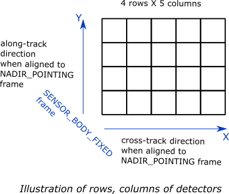

.. _basic_sensor_model_desc:

Basic Sensor Model
********************

The basic sensor model can be used to represent basic properties of an instrument: the field-of-view (FOV)/ scene-field-of-view (sceneFOV)/ field-of-regard (FOR)
and the orientation. Coverage (i.e. finding the locations which can be seen by the sensor) can be evaluated and viewing geometry parameters can calculated. 

The model also allows to configure a detector array geometry on a Focal Plane Array (FPA) which can be used to to simulate imagery by interpolating 
geo-physical data onto projected (ground) pixel positions.

Note that the coverage calculation and pixel-projection operations are available in the OrbitPy package.

.. todo:: Explain the synthetic data feature.

Model parameters
------------------

A ``BasicSensorModel`` object can be obtained from a json/ dict by using the ``from_json(.)`` or ``from_dict(.)`` functions. The expected key/value
pairs are described below:

.. csv-table:: Input parameter description 
    :header: Parameter, Data type, Units, Description
    :widths: 10,10,5,40

    @type, string, ,Must be *Basic Sensor*
    @id, string, , Unique identifier for the instrument. If ``None`` a random string is assigned.
    name, string, ,Full name of the instrument 
    mass, float, kilograms, Total mass of this entity.
    volume, float, :math:`m^3`, Total volume of this entity.
    power, float, Watts, Nominal operating power.
    orientation, :ref:`orientation_json_obj`, ,Orientation of the instrument. Default is alignment to the SC_BODY_FIXED frame.
    fieldOfViewGeometry, :ref:`fieldOfViewGeometry_json_obj`, , Field of view spherical geometry specification of the instrument. 
    sceneFieldOfViewGeometry, :ref:`sceneFieldOfViewGeometry_json_obj`, , The SceneFOV spherical geometry specification of the instrument. Default is the field-of-view spherical geometry specification.
    maneuver, :ref:`maneuver_json_object`, , Maneuver specifications (see :ref:`maneuv_desc`).
    pointingOption, :ref:`pointing_opt_json_obj`, , List of orientations to which the instrument axis can be maneuvered.
    syntheticDataConfig, :ref:`syntheticDataConfig_json_obj`, , Synthetic data configuration.
    dataRate, float, Mega-bits-per-s, Rate of data recorded during nominal operations.
    bitsPerPixel, integer, ,Bits encoded per pixel of image.
    numberDetectorRows, integer, ,Number of detector rows (along the Y-axis of the SENOR_BODY_FIXED frame). If the SENSOR_BODY_FIXED frame is aligned to the NADIR_POINTING frame; this direction corresponds to the along-track direction.
    numberDetectorCols, integer, ,Number of detector columns (along the X-axis of the SENOR_BODY_FIXED frame). If the SENSOR_BODY_FIXED frame is aligned to the NADIR_POINTING frame; this direction corresponds to the cross-track direction.
    

Model results
------------------

Using the basic-sensor model, coverage calculations (using the OrbitPy package) can be carried out over a region of interest. Coverage calculations which involve 
a grid (list of grid-points)) evaluate to see if the grid-points fall within the instrument sceneFOV (sceneFOV = FOV in most cases) or the FOR. The pointing-options feature further 
allows to automate coverage calculations for numerous instrument orientations. 

Once the coverage has been evaluated, the observable locations and the observer (satellite) locations is known. The following data metrics at the observable location 
on the surface of Earth can be calculated:

.. csv-table:: Observation data metrics table
    :widths: 8,4,4,20
    :header: Metric,Data Type,Units,Description 
     
    incidence angle [deg], float,  degrees, Incidence-angle at the target point calculated assuming spherical Earth.
    look angle [deg], float,  degrees, Look-angle to the target point calculated assuming spherical Earth. Positive sign => look is in positive half-space made by the orbit-plane (i.e. orbit plane normal vector) and vice-versa.
    observation range [km], float, kilometers, Distance from satellite to ground-point during the observation. 
    solar zenith [deg], float, degrees, Solar-zenith-angle during observation.

.. todo:: Include AT, CT footprint size calculations.

Model description
------------------

.. figure:: target_geom_3D.png
    :scale: 75 %
    :align: center
            
.. figure:: target_geom_2D.png
    :scale: 75 %
    :align: center

*   :math:`\mathbf{R = T - S}`
*   :math:`\gamma = \cos^{-1}(\mathbf{\dfrac{R}{|R|}} \cdot \mathbf{\dfrac{-S}{|S|}})`
*   :math:`\theta_i = \sin^{-1}(\sin\gamma  \hspace{1mm}  \dfrac{R_E + h}{R_E})`

Assuming spherical Earth of radius :math:`R_E`

where,

* :math:`\mathbf{S}`: Position-vector of the satellite in the EARTH_CENTERED_INERTIAL frame.
* :math:`\mathbf{T}`: Position-vector of the target ground-point in the EARTH_CENTERED_INERTIAL frame.
* :math:`\mathbf{R}`: Range vector from satellite to target ground point.
* :math:`\gamma`:  Look-angle to target ground point from satellite.
* :math:`\theta_i`: Incidence-angle at the target ground point.
* :math:`R_E`: Nominal equatorial radius of Earth.
* :math:`h`: Altitude of satellite.

Please refer to the :class:`instrupy.util.GeoUtilityFunctions.compute_sun_zenith` function for description of the calculation of the Sun-zenith angle.

Examples
---------
Please see the ``examples`` folder.