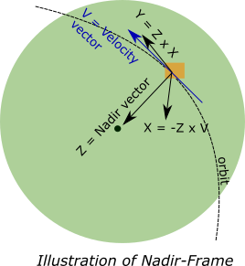
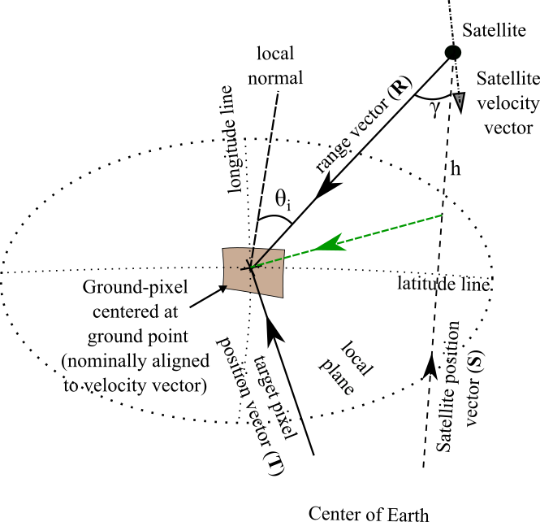
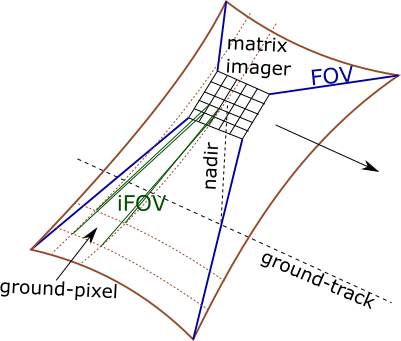
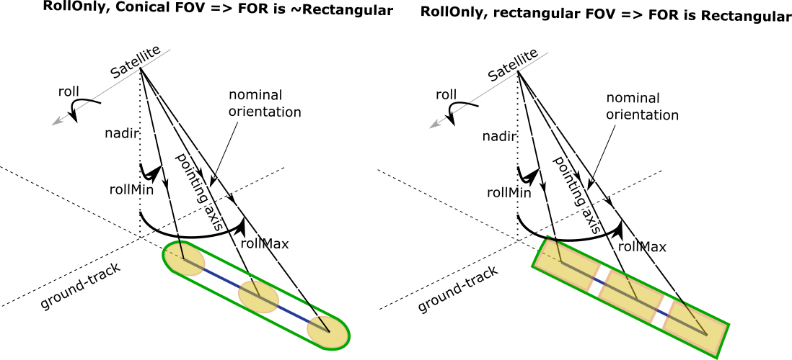

Miscellaneous
*************

.. _reference_frames_desc:

Reference Frames
====================

There are four reference frames of interest:

Earth Centered Inertial:
^^^^^^^^^^^^^^^^^^^^^^^^^^^^^^
This is an Earth equator inertial reference frame identical to EarthMJ2000Eq used in GMAT.
The nominal x-axis points along the line formed by the intersection of the Earth’s 
mean equatorial plane and the mean ecliptic plane (at the J2000 epoch), in the direction
of Aries. The z-axis is normal to the Earth’s mean equator at the J2000 epoch and the 
y-axis completes the right-handed system. The mean planes of the ecliptic and equator, 
at the J2000 epoch, are computed using IAU-1976/FK5 theory with 1980 update for nutation.

Earth Fixed:
^^^^^^^^^^^^^^^^^^
The Earth Fixed reference frame is referenced to the Earth's equator and the prime meridian 
and is computed using IAU-1976/FK5 theory. This system is identical to the EarthFixed
used in GMAT.

Nadir-pointing:
^^^^^^^^^^^^^^^^^
The axis of the Nadir-pointing reference frame are defined as follows:

* :math:`\bf X_{np}` axis: :math:`-({\bf Z_{np}} \times {\bf V})`, where :math:`\bf V` is the Velocity vector of satellite in EARTH_FIXED frame)
        
* :math:`\bf Y_{np}` axis: :math:`({\bf Z_{np}} \times {\bf X_{np}})`
        
* :math:`\bf Z_{np}` axis: Aligned to Nadir vector (i.e. the negative of the position vector of satellite in EARTH_FIXED frame)

.. todo:: Verify the claim about position vector and velocity vector in EARTH_FIXED frame.

Spacecraft Body Fixed:
^^^^^^^^^^^^^^^^^^^^^^^
Spacecraft Body Fixed reference frame. The axis of this coordinate system are aligned with the axis of the Spacecraft Bus.

.. _satellite_to_target_viewing_geometry:

Satellite to Target viewing geometry
=============================================

    Satellite-to-target geometry illustration

*   :math:`\mathbf{R = T - S}`
*   :math:`\gamma = \cos^{-1}(\mathbf{\dfrac{R}{|R|}} \cdot \mathbf{\dfrac{-S}{|S|}})`
*   :math:`\theta_i = \sin^{-1}(\sin\gamma  \hspace{1mm}  \dfrac{R_E + h}{R_E})`

Assuming spherical Earth of radius :math:`R_E`

where,

* :math:`\mathbf{S}`: Position-vector of the satellite in the Earth-Centered-Inertial frame (equatorial-plane)
* :math:`\mathbf{T}`: Position-vector of the target ground-point in the Earth-Centered-Inertial frame (equatorial-plane)
* :math:`\mathbf{R}`: Range vector from satellite to target ground point
* :math:`\gamma`:  Look-angle to target ground point from satellite
* :math:`\theta_i`: Incidence-angle at the target ground point
* :math:`R_E`: Nominal equatorial radius of Earth
* :math:`h`: altitude of satellite

.. _ifov_fov_scenefov_for_desc:

IFOV, FOV, Scene-FOV, FOR description
=============================================

* **IFOV:** The so called "Instantaneous" Field Of View, corresponding to the Field Of View (FOV) 
  of a single detector on a focal plane array of optical instruments. Note that this concept would not apply
  to a SAR.

* **FOV:** Field Of View of the instrument corresponding to the solid angle subtended by the sensor at any instant of time.

* **SceneFOV:** Instruments with narrow along-track FOV such as in the case of pushbroom scanners and SARs, build an observation 
  "scene" by scanning narrow strips along the direction of movement of the spacecraft. Hence a scene is built from multiple 
  concatenated strips. By defining a parameter called as the :code:`numStripsInScene` we can approximate the sceneFOV of such instruments
  to be rectangular such that the along-track FOV = instrument along-track FOV * :code:`numStripsInScene`. The cross-track FOV is the same as the original
  instrument cross-track FOV.  A key fallout of defining the SceneFOV is that, the SceneFOV corresponds to a certain length of scanning time. 
  
  Eg: Landsat TIRS (pushbroom) has along-track FOV of 141 urad. Swath width (corresponding to cross-track FOV = 15 deg) is 185 km.

  1.  Specifying :code:`numStripsInScene = 1011` gives the along-track sceneFOV = 8.1689 deg,
      (Hence 185km x 100km scene size). Scan time is 14s.
  
  2.  Specifying :code:`numStripsInScene = 101` gives the along-track sceneFOV = 0.8185 deg.
      185km x 10km scene size.  Scan time is 1.4s. 

.. note:: Even though the original FOV of the instrument maybe rectangular, the resulting SceneFOV is only approximately rectangular
          due to the rotation of the Earth. The approximation is good for small scan times.

* **FOR:** The Field Of Regard is the total angular region which *can be* (not *will be* as in case of FOV) covered by 
  the instrument at any instant of time. This applies for the case of manueverable payloads where the instrument orientation 
  can be changed.

  .. warning:: After computing the access over grid-points using the FOR, just because a grid point is accessed (at some time), it 
               does not imply that the sensor can be pointed to that grid-point. The grid-point can occur outside the maneuver zone and 
               within the FOR perimeter.

Illustrations
^^^^^^^^^^^^^^^

    IFOV vs FOV illustration for the case of a Matrix imager

.. figure:: fov_vs_scenefov.png
    :scale: 75 %
    :align: center

    FOV vs SceneFOV illustration for the case of a pushbroom scanner

.. figure:: fov_vs_for.png
    :scale: 75 %
    :align: center

    FOV/SceneFOV vs FOR illustration for the case of a possible -22.5 deg to 45 deg roll of satellite.

Representation of sensor FOV/ Scene-FOV with the :class:`instrupy.util.SphericalGeometry` object
^^^^^^^^^^^^^^^^^^^^^^^^^^^^^^^^^^^^^^^^^^^^^^^^^^^^^^^^^^^^^^^^^^^^^^^^^^^^^^^^^^^^^^^^^^^^^^^^^^^^^^^^^^^^^^^^^^^^^^^^
An object of the :code:`SphericalGeometry` class can be used to characterize a spherical geometry (polygon/circle). 
The spherical polygon is maintained internally via vector of cone and clock angles. This is the same definition as that 
in the orbitpy->propcov->lib->propcov-cpp CustomSensor C++ class. 

The pointing axis is assumed to be along the z-axis of the sensor frame. 
If (:math:`xP`, :math:`yP`, :math:`zP`) is a unit vector describing a point on the unit sphere, then the cone angle for the point is:

:math:`\pi/2 - \sin^{-1}zP`.

The clock angle for the point is:

:math:`atan2(yP,xP)`.

.. todo:: Extend the representation to include multiple non-intersecting spherical shapes. One way is to make the FOV representation 
        a list of spherical shapes and associate an orientation (i.e. position on the sphere) with each shape. 

Representation of sensor FOR
^^^^^^^^^^^^^^^^^^^^^^^^^^^^^^^^

TODO

.. _purely_side_looking:

Purely Side Looking Instruments
=================================

Some instruments such as Synthetic Aperture Radars operating under Stripmap mode are constrained to point sideways with 
a fixed squint angle (usually 0 squint). The SAR model in the :code:`instrupy` package assumes Stripmap operating mode 
with zero-squint angle and hence falls under the category of purely side-looking instruments. Further, since the imaging
takes place by imaging of consequetive strips and building a scene, a *SceneFOV* may be associated with the instrument. 

.. figure:: SAR_pure_sidelook.png
    :scale: 75 %
    :align: center

    SAR pure side looking geometry illustration.

.. _manuv_desc:

Manuverability and corresponging FOR calculations
===================================================

There are four types of maneuver which can be specified by the user. Depending on the geometry of the underlying FOV/ SceneFOV, 
a FOR is calculated as described below. 

1. :code:`"@type":"Fixed"`

   This is equivalent to specifying a no-manuever. The resulting FOR is equal to the instrument FOV/ SceneFOV.

2. :code:`"@type":"Yaw180"`

    This manuver option indicates that the pointing axis can be manuevered to an orientation at 180 deg about the 
    satellite yaw axis (nadir vector).  

3. :code:`"@type":"Cone"`

    This manuver option indicates that the pointing axis can be manuevered within a conical region (within a user-defined
    conical angle). The rotation about the pointing axis is unrestricted. The resulting FOR per sensor FOV is as follows:

        * Circular FOV sensor: FOR is conical with cone angle = manuver cone angle + sensor cone angle

        * Retangular FOV sensor: FOR is conical with cone angle = manuver cone angle + half diagonal angle of the rectangular FOV

        where half diagonal angle of the rectangular FOV = acos( cos(along-track FOV/2) . cos(cross-track FOV/2) )

4. :code:`"@type":"RollOnly"`

    This manuver option indicates that the pointing axis can be manuevered along the roll axis (satellite velocity vector)
    over a range indicated by :code:`rollMin` and :code:`rollMax`. The resulting FOR per sensor FOV is as follows:
       
        * Circular FOV sensor: FOR is rectangular with:
            
            cross track = (rollMax - rollMin) + sensor full cone angle

            along-track = sensor along track

        * Rectangular FOV sensor: FOR is rectangular with:
            
            cross-track = (rollMax - rollMin) + sensor cross track 

            along-track = sensor along track

5. :code:`"@type":"Yaw180Roll"`

    This manuver option indicates combines the :code:`"@type":"Yaw180"` and :code:`"@type":"RollOnly"` options.

.. figure:: cone_yaw180_maneuver.png
    :scale: 75 %
    :align: center

    Illustration of Cone maneuver and Yaw180 maneuver for rectangular FOV instruments

    Illustration of RollOnly maneuver for circular and rectangular FOV instruments

