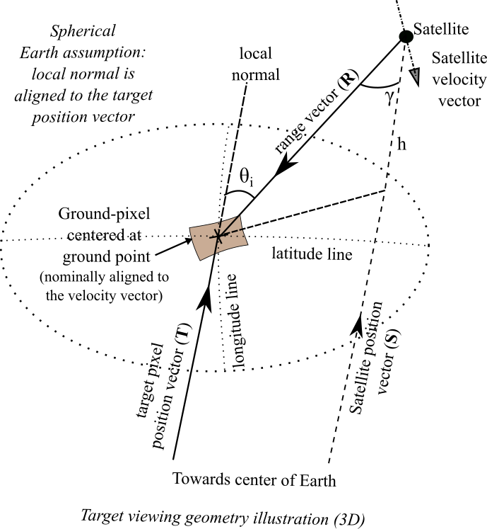

Miscellaneous
*************

.. _reference_frames_desc:

Reference Frames
====================

There are five reference frames of interest:

Earth Centered Inertial:
^^^^^^^^^^^^^^^^^^^^^^^^^^^^^^
This is an Earth equator inertial reference frame identical to EarthMJ2000Eq used in GMAT.
The nominal x-axis points along the line formed by the intersection of the Earth’s 
mean equatorial plane and the mean ecliptic plane (at the J2000 epoch), in the direction
of Aries. The z-axis is normal to the Earth’s mean equator at the J2000 epoch and the 
y-axis completes the right-handed system. The mean planes of the ecliptic and equator, 
at the J2000 epoch, are computed using IAU-1976/FK5 theory with 1980 update for nutation.

Earth Fixed:
^^^^^^^^^^^^^^^^^^
The Earth Fixed reference frame is referenced to the Earth's equator and the prime meridian 
and is computed using IAU-1976/FK5 theory. This system is identical to the EarthFixed
used in GMAT.

Nadir-pointing:
^^^^^^^^^^^^^^^^^
The axis of the Nadir-pointing reference frame are defined as follows:

* :math:`\bf X_{np}` axis: :math:`-({\bf Z_{np}} \times {\bf V})`, where :math:`\bf V` is the Velocity vector of satellite in EARTH_FIXED frame)
        
* :math:`\bf Y_{np}` axis: :math:`({\bf Z_{np}} \times {\bf X_{np}})`
        
* :math:`\bf Z_{np}` axis: Aligned to Nadir vector (i.e. the negative of the position vector of satellite in EARTH_FIXED frame)

.. figure:: nadirframe.png
    :scale: 100 %
    :align: center

.. todo:: Verify the claim about position vector and velocity vector in EARTH_FIXED frame.

Spacecraft Body Fixed:
^^^^^^^^^^^^^^^^^^^^^^^
Spacecraft Body Fixed reference frame. The axis of this coordinate system are aligned with the axis of the Spacecraft Bus.

Sensor Body Fixed:
^^^^^^^^^^^^^^^^^^^^

Sensor Body Fixed reference frame. The axis of this coordinate system are aligned with the axis of the Sensor.

.. _satellite_to_target_viewing_geometry:

Satellite to Target viewing geometry
=============================================

            

*   :math:`\mathbf{R = T - S}`
*   :math:`\gamma = \cos^{-1}(\mathbf{\dfrac{R}{|R|}} \cdot \mathbf{\dfrac{-S}{|S|}})`
*   :math:`\theta_i = \sin^{-1}(\sin\gamma  \hspace{1mm}  \dfrac{R_E + h}{R_E})`

Assuming spherical Earth of radius :math:`R_E`

where,

* :math:`\mathbf{S}`: Position-vector of the satellite in the EARTH_CENTERED_INERTIAL frame.
* :math:`\mathbf{T}`: Position-vector of the target ground-point in the EARTH_CENTERED_INERTIAL frame.
* :math:`\mathbf{R}`: Range vector from satellite to target ground point.
* :math:`\gamma`:  Look-angle to target ground point from satellite.
* :math:`\theta_i`: Incidence-angle at the target ground point.
* :math:`R_E`: Nominal equatorial radius of Earth.
* :math:`h`: Altitude of satellite.

.. _ifov_fov_scenefov_for_desc:

IFOV, FOV, Scene-FOV, FOR description
=============================================

* **IFOV:** The so called "Instantaneous" Field Of View, corresponding to the Field Of View (FOV) 
  of a single detector on a focal plane array of optical instruments. Note that this concept would not apply
  to a SAR.

* **FOV:** Field Of View of the instrument corresponding to the solid angle subtended by the sensor at any instant of time.

* **SceneFOV:** Instruments with narrow along-track FOV such as in the case of pushbroom scanners and SARs, build an observation 
  "scene" by scanning narrow strips along the direction of movement of the spacecraft. Hence a scene is built from multiple 
  concatenated strips. By defining a parameter called as the :code:`numStripsInScene` we can approximate the sceneFOV of such instruments
  to be rectangular such that the along-track FOV = instrument along-track FOV * :code:`numStripsInScene`. The cross-track FOV is the same as the original
  instrument cross-track FOV.  A key fallout of defining the SceneFOV is that, the SceneFOV corresponds to a certain length of scanning time. 
  
  Eg: Landsat TIRS (pushbroom) has along-track FOV of 141 urad. Swath width (corresponding to cross-track FOV = 15 deg) is 185 km.

  1.  Specifying :code:`numStripsInScene = 1011` gives the along-track sceneFOV = 8.1689 deg,
      (Hence 185km x 100km scene size). Scan time is 14s.
  
  2.  Specifying :code:`numStripsInScene = 101` gives the along-track sceneFOV = 0.8185 deg.
      185km x 10km scene size.  Scan time is 1.4s. 

.. note:: Even though the original FOV of the instrument maybe rectangular, the resulting SceneFOV is only approximately rectangular
          due to the rotation of the Earth. The approximation is good for small scan times.

* **FOR:** The Field Of Regard is the total angular region which *can be* (not *will be* as in case of FOV) covered by 
  the instrument at any instant of time. This applies for the case of maneuverable payloads where the instrument orientation 
  can be changed.

  .. warning:: After computing the access over grid-points using the FOR, just because a grid point is accessed (at some time), it 
               does not imply that the sensor can be pointed to that grid-point. The grid-point can occur outside the maneuver zone and 
               within the FOR perimeter.

Illustrations
^^^^^^^^^^^^^^^

.. figure:: ifov_vs_fov.png
    :scale: 75 %
    :align: center

    IFOV vs FOV illustration for the case of a Matrix imager

.. figure:: fov_vs_scenefov.png
    :scale: 75 %
    :align: center

    FOV vs SceneFOV illustration for the case of a pushbroom scanner

.. figure:: fov_vs_for.png
    :scale: 75 %
    :align: center

    FOV/SceneFOV vs FOR illustration for the case of a possible -22.5 deg to 45 deg roll of satellite.

Representation of sensor FOV/ Scene-FOV/ FOR with the :class:`instrupy.util.ViewGeometry` object
^^^^^^^^^^^^^^^^^^^^^^^^^^^^^^^^^^^^^^^^^^^^^^^^^^^^^^^^^^^^^^^^^^^^^^^^^^^^^^^^^^^^^^^^^^^^^^^^^^^^^^^^^^^^^^^^^^^^^^^^
An object of the :code:`ViewGeometry` container class can be used to characterize the FOV/ Scene FOV/ FOR of an instrument. 
The :code:`SphericalGeometry` member of the container describes the spherical geometry (spherical polygon/ circle) in the SENSOR_BODY_FIXED frame 
with the Z-axis as the pointing axis. 

If (:math:`xP`, :math:`yP`, :math:`zP`) is a unit vector describing a point on the unit sphere, then the cone angle for the point is:

:math:`\pi/2 - \sin^{-1}zP`.

The clock angle for the point is:

:math:`atan2(yP,xP)`.

.. figure:: cone_clock_angle.png
    :scale: 100 %
    :align: center

The :code:`SphericalGeometry` member is paired with an :class:`Orientation` member which describes the orientation of the sensor (hence the SENSOR_BODY_FIXED frame)
with respect to a reference frame) to obtain the position of the spherical geometry in any desired reference frame.

.. note:: In the current :class:`instrupy` implementation when used to model the FOR, the Orientation is always defined with respect to the 
             NADIR_POINTING reference frame. 

.. _purely_side_looking:

Purely Side Looking Instruments
=================================

Some instruments such as Synthetic Aperture Radars operating under Stripmap mode are constrained to point sideways with 
a fixed squint angle (usually 0 squint). The SAR model in the :code:`instrupy` package assumes Stripmap operating mode 
with zero-squint angle and hence falls under the category of purely side-looking instruments. Further, since the imaging
takes place by imaging of consecutive strips and building a scene, a *SceneFOV* may be associated with the instrument. 

.. figure:: SAR_pure_sidelook.png
    :scale: 75 %
    :align: center

    SAR pure side looking geometry illustration.

.. _maneuv_desc:

Maneuverability and corresponding Field Of Regard (FOR) calculations
=====================================================================

The maneuverability is specified with reference to the NADIR_POINTING frame. The maneuver specifications 
describe the angular-space, where the pointing axis of the sensor can be positioned.

The FOR is characterized in terms of a proxy-sensor setup. The proxy sensor setup is characterized by orientation (wrt the NADIR_POINTING frame) of the proxy-sensor 
and a spherical geometry (polygon/circle) specification of the proxy-sensor's field-of-view. This proxy-sensor setup allows to calculate all coverage opportunities
by the (satellite + sensor) pair, taking into account the satellite and/or sensor maneuverability. 
Note that only CIRCULAR or RECTANGULAR shaped sensor FOV/ Scene FOV are permitted as inputs. 

Following maneuver categories are recognized: :code:`CIRCULAR`, :code:`SINGLE_ROLL_ONLY` and :code:`DOUBLE_ROLL_ONLY`.
All maneuvers are with respect to the NADIR_POINTING frame.

1. :code:`"@type":"CIRCULAR"`

    This maneuver option indicates that the pointing axis can be maneuvered within a circular region (corresponding to a
    specified angular diameter) *around* the z-axis (nadir-direction). The rotation about the pointing axis is unrestricted. 
    The resulting FOR is characterized by a proxy-sensor as follows:

    * The proxy-sensor orientation is aligned to the NADIR_POINTING frame.

    * If input sensor FOV is CIRCULAR: 
        
        proxy-sensor FOV is CIRCULAR with diameter = maneuver diameter + input FOV diameter

    * If input sensor FOV is RECTANGULAR: 
        
        proxy-sensor FOV is CIRCULAR with diameter = maneuver diameter + diagonal angle of the input rectangular FOV

        where diagonal angle of the RECTANGULAR FOV = 2 acos( cos(angle_width/2) . cos(angle_height/2) )

    .. figure:: circular_maneuver.png
        :scale: 75 %
        :align: center

2. :code:`"@type":"SINGLE_ROLL_ONLY"`

    This maneuver option indicates that the pointing axis can be maneuvered about the roll axis (= y-axis of the NADIR_POINTING frame) 
    over a (single) range indicated by minimum and maximum roll angles. The resulting FOR characterized by a proxy-sensor is as follows:

    * The proxy-sensor orientation is at a roll-position (wrt to the NADIR_POINTING frame) as follows:
        
        roll position = rollMin + 0.5 * (rollMax - rollMin)

    * If input sensor FOV is CIRCULAR: 
        
        proxy-sensor FOV is rectangular with:
        
        angle width = (rollMax - rollMin) + input FOV diameter

        angle height = input FOV diameter

    * If input sensor FOV is RECTANGULAR: 
        
        proxy-sensor FOV is rectangular with:
        
        angle width  = (rollMax - rollMin) + input FOV angle width

        angle height = input FOV angle height

    .. figure:: single_rollonly_maneuver.png
        :scale: 75 %
        :align: center

3. :code:`"@type":"DOUBLE_ROLL_ONLY"`

    This maneuver option is similar to the SINGLE_ROLL_ONLY case, except that there are **two** 
    (potentially non-overlapping) ranges of roll-angles (minimum and maximum angles).

    .. figure:: double_rollonly_maneuver.png
        :scale: 75 %
        :align: center

