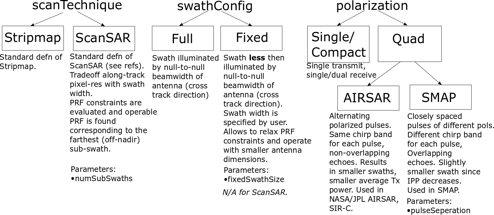

.. _synthetic_aperture_radar_model_desc:

Synthetic Aperture Radar Model
*******************************
The synthetic aperture radar model is based on the references listed below. The current version allows only for rectangular antenna specifications
and uniform aperture excitation profile. 
The implementation allows for modeling different *configurations* of the instrument (see figure below): 

1. *Scan technique:* Stripmap or ScanSAR supported.
2. *Swath configuration:* Imaging of the entire illuminated swath or imaging a smaller swath of fixed size (irrespective of the 
   instrument look angle) is supported. 
3. *Polarization:* Single/ Compact or Quad polarization can be specified. In case of Quad-pol, either the *AIRSAR* [4] or *SMAP* [5] pulse configuration should be chosen.

   Supported SAR configurations. 

The FOV of the instrument is calculated from the antenna specifications (beamwidth) and the instrument orientation. A sceneFOV can be specified
separately. The FOR is built based on the sceneFOV and the maneuver specifications. *ROLL_ONLY* and *DOUBLE_ROLL_ONLY* maneuver specifications are supported since
the model supports only sidelooking SAR configuration.
The FOV/ sceneFOV/ FOR is used in the coverage calculations (using the OrbitPy package) to find the locations accessed on the ground.

.. note:: See :ref:`synthetic_aperture_radar_glossary` for names of the variables used in any discussion below.

**References:**

*General concepts:*

1. Performance Limits for Synthetic Aperture Radar - second edition SANDIA Report 2006. ----> Main reference.
2. Spaceborne SAR Study: LDRD 92 Final Report SANDIA Report March 1993. ----> Reference for PRF validity calculations, corrections for spaceborne radar.
3. V. Ravindra and S. Nag, "Instrument Data Metrics Evaluator for Tradespace Analysis of Earth Observing Constellations," 2020 IEEE Aerospace Conference, Big Sky, MT, USA, 2020.

*Polarimetry concepts:*

4. *Synthetic Aperture Radar Polarimetry,  Jakob Van Zyl* ----> Reference for compact-pol and AIRSAR implementation for dual-pol.
5. *SMAP Handbook* ----> Reference for SMAP implementation of dual-pol.

*ScanSAR concepts:*

6. Tomiyasu, Kiyo. "Conceptual performance of a satellite borne, wide swath synthetic aperture radar." IEEE Transactions on Geoscience and Remote Sensing 2 (1981): 108-116.
7. Moore, Richard K., John P. Claassen, and Y. H. Lin. "Scanning spaceborne synthetic aperture radar with integrated radiometer." IEEE Transactions on Aerospace and Electronic Systems 3 (1981): 410-421.
8. Currie, A., and Ma A. Brown. "Wide-swath SAR." In IEE Proceedings F (Radar and Signal Processing), vol. 139, no. 2, pp. 122-135. IET Digital Library, 1992.
9. Chang, Chi-Yung, Michael Y. Jin, Yun-Ling Lou, and Benjamin Holt. "First SIR-C scansar results." IEEE transactions on geoscience and remote sensing 34, no. 5 (1996): 1278-1281.

.. todo:: Include frequency dependent atmospheric losses in :math:`\\sigma_{NESZ}` calculations.

.. todo:: Make separate objects for scanning-technique similar to the one in Radiometer model?

Model parameters
=================

A ``SyntheticApertureRadarModel`` object can be obtained from a json/ dict by using the ``from_json(.)`` or ``from_dict(.)`` functions. The expected key/value
pairs are described below:

.. csv-table:: Input parameter description 
   :header: Parameter, Data type,Units,Description
   :widths: 10,10,8,40

   @type, string, ,Must be *Synthetic Aperture Radar*
   @id, string, , Unique identifier for the instrument. If ``None`` a random string is assigned.
   name, string, ,Full name of the instrument 
   mass, float, kilograms,Total mass of this entity.
   volume, float, :code:`m^3`,Total volume of this entity.
   power, float, Watts, Nominal operating power.
   orientation, :ref:`orientation_json_obj`, ,Orientation of the instrument. Only orientation of :code:`"convention": "SIDE_LOOK"` is accepted.
   dataRate, float, Megabits per sec,Rate of data recorded during nominal operations.
   bitsPerPixel, integer, ,Bits encoded per pixel of image.
   sceneFieldOfViewGeometry, :ref:`sceneFieldOfViewGeometry_json_obj`, , The SceneFOV spherical geometry specification of the instrument. Default is the field-of-view spherical geometry specification.
   pulseWidth, float, seconds, Actual pulse width (per channel/polarization).
   antenna, :ref:`antenna_json_object`, , Antenna specifications. Only rectangular shape and uniform aperture excitation profile is accepted.
   operatingFrequency, float, Hertz, Operating radar center frequency.
   peakTransmitPower, float, Watts, Peak transmit power.
   chirpBandwidth, float, Hertz, Bandwidth of radar operation (per channel/polarization).
   minimumPRF, float, Hertz, "The minimum pulse-repetition-frequency of operation (if dual-pol with alternating pol pulses, the PRF specification is considered taking all pulses into account (i.e. is considered as the PRFmaster))."
   maximumPRF, float,  Hertz, "The maximum pulse-repetition-frequency of operation (if dual-pol with alternating pol pulses, the PRF specification is considered taking all pulses into account (i.e. is considered as the PRFmaster))."
   sceneNoiseTemp, float, Kelvin, Nominal scene noise temperature.
   systemNoiseFigure, float, decibels, System noise figure for the receiver. See Pg.15 in [1].
   radarLosses, float, decibels, These include a variety of losses primarily over the microwave signal path but doesn't include the atmospheric loss. See Pg.15 in [1].
   atmosLoss, float, decibels, 2-way atmospheric loss of electromagnetic energy (see Pg.16 in [1]).
   maneuver, :ref:`maneuver_json_object`, , Maneuver specifications (see :ref:`maneuv_desc`).
   pointingOption, :ref:`pointing_opt_json_obj`, , List of orientations to which the instrument axis can be maneuvered.    
   polarization, :ref:`sar_pol_json_object`, ,Polarization configuration. Default is *SINGLE* polarization.
   swathConfig, :ref:`sar_swath_config_json_object`, ,Swath Configuration. Default is *FULL* swath.       
   scanTechnique, str, , Scanning technique. Accepted values are *Stripmap* or *ScanSAR*. Default is *Stripmap*.
   numSubSwaths, int, , Number of sub-swaths (required in case of ScanSAR). Default is 1.  

.. _sar_swath_config_json_object:

:code:`swathConfig` JSON object
----------------------------------
Two configurations (types) are accepted: *FULL* and *FIXED*.  
This should be indicated in the :code:`@type` name, value pair. If this JSON object is absent, *FULL* swath configuration is assumed.

1. :code:`"@type":"Full"` 

   The *FULL* swath configuration implies that the entire swath illuminated by the antenna main-beam is processed. No other parameters are required.

   Example:

   .. code-block:: python
      
      "swathConfig":{
            "@type": "full"
      }

2. :code:`"@type":"Fixed"` 

   The *FIXED* swath configuration allows the user to specify a swath size (less then the size of the illuminated swath) to be processed. 
   Default is 10km. If the specified fixed-swath size is more then the illuminated swath size, the entire illuminated swath shall be 
   considered to the processed swath.

   .. csv-table:: Expected parameters
      :header: Parameter, Data type, Units, Description
      :widths: 10,10,5,40

      fixedSwathSize, float, kilometers ,Imaged Swath size

   Example:

   .. code-block:: python
      
      "swathConfig":{
            "@type": "fixed",     
            "fixedSwathSize": 25
      }

.. _sar_pol_json_object:

:code:`polarization` JSON object
----------------------------------
Polarization specifications. Three types of polarization are accepted: `single`, `compact` and `dual`. This should be indicated 
in the :code:`@type` name, value pair. If this JSON object is absent, (default) single polarization is assumed.

1. :code:`"@type":"single"` 

   Single transmit and receive polarization.

   .. csv-table:: Expected parameters
      :header: Parameter, Data type, Units, Description
      :widths: 10,10,5,40

      txPol, str, ,Transmit polarization (eg: H)
      rxPol, str, ,Receive polarization (eg: H)

   .. code-block:: python
      
      "polarization":{
            "@type": "single",
            "txPol": "H",
            "rxPol": "V"
      }

2. :code:`"@type":"compact"` 

   Single transmit and dual receive polarization.

   .. csv-table:: Expected parameters
      :header: Parameter, Data type, Units, Description
      :widths: 10,10,5,40

      txPol, str, ,Transmit polarization (eg: 45degLinPol)
      rxPol, str, ,Receive polarization (eg: H and V)

   .. code-block:: python
      
      "polarization":{
            "@type": "compact",
            "txPol": "H",
            "rxPol": "H,V"
      }

3. :code:`"@type":"dual"`

   Dual transmit and dual receive polarization. The :code:`pulseConfig` JSON object is used to specify the configuration of the pulse
   train used to enable dual-pol. Default is `AIRSAR` configuration.

   .. csv-table:: Expected parameters
      :header: Parameter, Data type, Units, Description
      :widths: 10,10,5,40

      txPol, str, ,Transmit polarization (eg: H and V)
      rxPol, str, ,Receive polarization (eg: H and V)
      pulseConfig, :ref:`pulseConfig_json_object`, ,Configuration of the pulse train. 

.. _pulseConfig_json_object:

:code:`pulseConfig` JSON object
.................................

i. :code:`@type: "AIRSAR"`

   This pulse configuration is the same as the one implemented by the NASA/JPL AIRSAR systems (see Pg.32, Fig.2-5 in [4]). It consists of transmitting alternating pulses of orthogonal
   polarization and filtering the received signal into separate orthogonal polarizations.

   Note that the `minimumPRF` and `maximumPRF` user specifications shall apply to the entire transmit pulse train (i.e. considering both the polarizations).

   .. code-block:: python
      
      "polarization":{
            "@type": "dual",
            "txPol": "H,V",
            "rxPol": "H,V",
            "pulseConfig":{
               "@type": "AIRSAR"
            }
      }

ii. :code:`"@type":"SMAP"` 

   This pulse configuration is the same as the one implemented by the SMAP radar (see Pg.41, Fig.26 in [5]). It consists of two slightly separated pulses of 
   orthogonal polarizations at different frequency bands. The received signal is separated into the respective band and the orthogonal 
   polarizations measured. This requires an additional parameter called as the :code:`pulseSeparation` to indicate the separation 
   between the pulses of the two orthogonal polarizations. If not specified a default value of 50% of the pulse-width (:code:`pulseWidth`) is considered.

   .. csv-table:: Expected parameters
      :header: Parameter, Data type, Units, Description
      :widths: 10,10,5,40

      pulseSeparation, float, seconds, Separation between orthogonal polarized pulses. Default: 0.5*pulse-width.

   Example:

   .. code-block:: python
      
      "polarization":{
            "@type": "dual",     
            "txPol": "H,V",
            "rxPol": "H,V",
            "pulseConfig":{
               "@type": "SMAP",
               "pulseSeparation": 9e-6
      }

Model results
==============
Using the synthetic aperture radar model, coverage calculations (using the OrbitPy package) can be carried out over a region of interest. Coverage calculations which involve 
a grid (list of grid-points) evaluate to see if the grid-points fall within the instrument sceneFOV (sceneFOV = FOV in most cases) or the FOR. The pointing-options feature further 
allows to automate coverage calculations for numerous instrument orientations. 

Once the coverage has been evaluated, the observable locations and the observer (satellite) locations is known. The following data metrics at the observable location 
on the surface of Earth can be calculated:

.. csv-table:: Observation data metrics table
    :widths: 8,4,4,20
    :header: Metric/Aux data,Data Type,Units,Description
                                                                                                                                                                                                                                                                                                                                                          
   incidence angle [deg], float, degrees, Incidence angle at target point calculated assuming spherical Earth.                                                                                                                       
   swath-width [m], float, meters, Swath-width of the strip of which the imaged pixel is part-off.                                                                                        
   NESZ [dB], float, decibels, The backscatter coefficient of a target for which the signal power level in final image is equal to the noise power level. **Numerically lesser is better instrument performance.**       
   ground pixel along-track resolution [m], float, meters, Along-track resolution of a ground-pixel centered about observation point.                                                                                                                        
   ground Pixel cross-track resolution [m], float, meters, Cross-track pixel resolution of a ground-pixel centered about observation point.     
   PRF [Hz], float, Hertz, Highest Pulse Repetition Frequency (Hz) (within the specified PRF range) at which the observation is possible.

Model description
==================

Below text lays down the formulae coded into the model.

Viewing geometry
-----------------------

The viewing geometry parameters, i.e. :math:`\mathbf{S}`, :math:`\mathbf{T}`, :math:`\mathbf{R}`, :math:`\theta_i` and :math:`\gamma` are determined using the setup 
described in :ref:`basic sensor model description<basic_sensor_model_desc>`.

Swath-width
--------------
.. note:: While calculating swath width the instrument look angle (not the look angle to the target ground-point) must be used. This is because the 
          ground-point may not be at the ~middle of the swath.

Illuminated (FULL) swath-width
....................................

Illuminated swath refers to the swath illuminated by the antenna main beam. *See [2] Pg 23 and 24 (Fig. 5.1.3.1)*

:math:`R_S = R_E + h`   

:math:`\gamma_n = \gamma_I - 0.5 \hspace{1mm} \theta_{elv}`

:math:`\gamma_f = \gamma_I  + 0.5 \hspace{1mm} \theta_{elv}`

:math:`\theta_{in} = \sin^{-1}(\sin(\gamma_n) R_S/R_E)`

:math:`\theta_{if} = \sin^{-1}(\sin(\gamma_f) R_S/R_E)`

:math:`\alpha_n = \theta_{in} - \gamma_n`

:math:`\alpha_f = \theta_{if} - \gamma_f`

:math:`\alpha_s = \alpha_f - \alpha_n`

:math:`W_{gr} = R_E \alpha_s`   

ScanSAR with multiple sub-swaths
...................................

Substitute :math:`\theta_{elv}` with :math:`n_{ss} \hspace{1mm} \theta_{elv}` and calculate the swath-width using the equations above. Note that only
FULL swath configuration for each sub-swath is allowed, i.e. each sub-swath is the complete illuminated swath.

Desired (FIXED) swath-width
...............................

Desired swath refers to the swath corresponding to the desired portion of the echo from the (longer) echo of the antenna main-lobe.

:math:`\alpha_s = W_{gr}/R_E`

:math:`\theta_{im} = \sin^{-1}(\sin(\gamma_I) R_S/R_E)`

:math:`\alpha_m = \theta_{im} - \gamma_m` [2] equation 5.1.3.5

:math:`\alpha_n =  \alpha_m - 0.5 \alpha_s` [2] equation 5.1.3.7

:math:`\alpha_f =  \alpha_m + 0.5 \alpha_s` [2] equation 5.1.3.8

Ground pixel resolution calculations
--------------------------------------

From *[1] equations 36, 23* we can get the target ground-pixel (projected) range resolution :math:`\rho_y`

:math:`\rho_y = \dfrac{a_{wr} c}{2 B_T \cos\psi_g}`

From *[2] equation (5.3.6.3)* we get the minimum (# looks = 1) possible azimuth resolution of the ground-pixel resolution.

:math:`\rho_a = n_{ss} \dfrac{D_{az}}{2} \dfrac{v_g}{v_s}`

.. note:: It is assumed that the generated target geometry (from the satellite position and the target position) is such that the 
          instrument sees the ground-pixel at a strictly side-look geometry. 

:math:`NESZ` calculations
--------------------------

:math:`\psi_g = \dfrac{\pi}{2} - \theta_i` 

Use *[1] equation (17)* to find average transmit power :math:`P_{avg}`

:math:`T_{eff} = \tau_p` (approximate the effective pulse duration to be equal to the actual pulse duration, as in case of matched filter processing)

:math:`d = T_{eff} \hspace{1mm} f_P` 

:math:`P_{avg} = d \hspace{1mm} P_T`

Use *[1] equation 8*, find antenna gain :math:`G_A`

:math:`A_A = D_{elv} \hspace{1mm} D_{az}`

:math:`G_A = 4 \pi \dfrac{\eta_{ap} A_A}{\lambda^2}`                

*[1] equation 37* we can get the :math:`NESZ`

:math:`NESZ = \dfrac{265 \pi^3 k T}{c} (R^3  v_s  \cos\psi_g) \dfrac{ B_T F_N L_{radar} L_{atmos}}{P_{avg} G_A^2 \lambda^3} \dfrac{L_r L_a}{a_{wr} a_{wa}}`

:math:`NESZ_{dB} = 10 log_{10} NESZ`

Following default values are used, :math:`L_{atmos}=2 dB`, :math:`L_r = L_a = a_{wr} = a_{wa} = 1.2`   

.. note:: :math:`v_s` is to be used here and not :math:`v_g`. See [2] for more explanation.

.. note:: The :math:`NESZ` calculation is the same for the case of ScanSAR and Stripmap.

Field-of-View calculations
---------------------------

The antenna is assumed to be planar with dimensions :math:`D_{az}` and :math:`D_{elv}`. The along-track and cross-track 
antenna beamwidth is calculated as: 

:math:`\theta_{az} = \lambda / D_{az}`,     *[1] (eqn 41)*  

:math:`\theta_{elv} = \lambda / D_{elv}`

The along-track and cross-track (full) field-of-view angles are calculated from the respective antenna beamwidths as follows:

:math:`\theta_{AT} = \theta_{az}`

:math:`\theta_{CT} = n_{ss} \theta_{elv}`

In case of Stripmap :math:`n_{ss} = 1` and in case of ScanSAR :math:`n_{ss} > 1`.

Checking validity of pulse repetition frequency (PRF)
---------------------------------------------------------

The user supplies a range of PRF of the SAR instrument. Depending on the viewing geometry a usable/ valid PRF has to be selected for target observation. 
[2] is the primary reference for this formulation, although some errors have been found (and corrected in the current
implementation). [3] contains the corrections. The referenced formulation is further modified to incorporate the PRF constraints
involving observations of multiple polarizations and fixed-swath (desired echo vs complete echo). 

Of all the available valid PRFs, the highest PRF is chosen in the NESZ calculation since it improves the NESZ observation data-metric.

.. note:: The instrument look-angle (and **not** the look-angle at the ground-point) is considered while evaluating the near range and far range and hence the operable PRF.

The below conditions need to be satisfied:

1. The length of the echo from illuminated/ desired swath is less than inter-pulse period. See [2] Pg 22, 23 and 24.

    :math:`R_n = \sqrt(R_E^2 + R_S^2 - 2 R_E R_S \cos\alpha_n)` 

    :math:`R_f = \sqrt(R_E^2 + R_S^2 - 2 R_E R_S \cos\alpha_f))` 
            
    :math:`\tau_{near} = 2\hspace{1mm}Rn/c`

    :math:`\tau_{far} = 2\hspace{1mm}Rf/c` 

    :math:`PRF_{MAX} = 1.0/(2.0\hspace{1mm}\tau_p + \tau_{far} - \tau_{near})` 

2. The PRF should be high enough to allow for unambiguous detection of doppler shifts.

    :math:`PRF_{MIN} = \dfrac{v_s}{\rho_{a}}` *[2] equation 5.4.4.2*

    .. note:: The :math:`PRF_{MIN}` calculation is same for the case of ScanSAR and Stripmap.

3. A transmit pulse does not overlap with the desired echo.

    :math:`N = int(f_P \dfrac{2 R_n}{c}) + 1`

    :math:`\dfrac{N-1}{\tau_{near}-\tau_p} < f_P  < \dfrac{N}{\tau_{far} + \tau_p}` *[2] inequality 5.1.4.1*

4. The echo from Nadir doesn't overlap with the desired echo. Nadir echo is strong
   (even though the antenna gain in the Nadir direction maybe small) since the range to Nadir is small.

    .. warning:: [2] inequality 5.1.5.2 which gives the Nadir interference condition seems wrong. Refer to [3] Appendix Section A for the corrected version (R2 in [3] eqn(38) is a type, and must be replaced by Rn).            

    :math:`\tau_{nadir} = \dfrac{2 h}{c}`

    :math:`M = \textrm{int}(f_P \dfrac{2 R_f}{c}) + 1`

    :math:`1 <= m <= M`

    :math:`\dfrac{m}{\tau_{near} - \tau_p - \tau_{nadir}} < f_P` (or)
    :math:`f_P< \dfrac{m}{\tau_{far} + \tau_p - \tau_{nadir}}`     
     
Of all the available valid PRFs, the highest PRF is chosen since it improves the :math:`NESZ` observation data-metric.
The reason is that the average transmit power increases (since we keep the transmit pulse length constant), and hence the received 
image signal-to-noise-ratio increases.

.. note:: The chosen PRF must satisfy all the above PRF constraints over the entire swath. However, InstruPy only verifies the validity of the PRF at the
         ~middle of the swath (determined by the instrument look angle). In case of ScanSAR the farthest (off-nadir) sub-swath is chosen and the
         validity is verified at the ~middle of this sub-swath. In ScanSAR operation the different sub-swaths would have different associated PRFs.

Dual-pol (AIRSAR/ SMAP) considerations
------------------------------------------

In case of dual-polarization additional considerations must be taken into account while calculating the PRF validity and :math:`NESZ`.

AIRSAR dual-pol config [4]
............................

The PRF range specified by the user refers to the range of the master PRF (:math:`PRF_{master}`), i.e. the PRF calculated 
considering pulses from both the channels. 

The PRF minimum constraint as calculated in the single-pol/ compact-pol apply, albeit to each 
*channel*, i.e. each polarization. Thus :math:`PRF_{ch} = 0.5 PRF_{master}` needs to satisfy the PRF minimum constraint, 
where :math:`PRF_{ch}` is the channel PRF.

The PRF maximum constraint as calculated in the single-pol/ compact-pol needs to be applied on the :math:`PRF_{master}`. 
Thus :math:`PRF_{master}` needs to satisfy the PRF maximum constraint. Likewise the :math:`PRF_{master}` needs to satisfy 
the transmit-pulse non-overlap and nadir-echo non-overlap conditions. 

The :math:`NESZ` calculation is done by considering the PRF of each channel i.e. :math:`PRF_{ch}`.

SMAP dual-pol config [5]
.............................

The PRF constraint calculations must be evaluated by considering that the
total-pulse-width = 2 * :code:`pulseWidth` + :code:`pulseSeparation`

where :code:`pulseWidth` is the user input pulse width per polarization and :code:`pulseSeparation` is the 
separation between the pulses of the orthogonal polarization.

The :math:`NESZ` calculation is to be done with the pulse-width = :code:`pulseWidth`

Examples
=========
Please see the ``examples`` folder.

.. _synthetic_aperture_radar_glossary:

Glossary
=========

.. note:: The same variable names as in the references are followed as much as possible. However it becomes difficult when merging the formulation in
          case of multiple references. 

* :math:`R_S`: Distance to the satellite from origin in an CARTESIAN_EARTH_CENTERED_INERTIAL. 
* :math:`\theta_i`: Incidence angle at the target ground point.
* :math:`R_E`: Nominal equatorial radius of Earth.
* :math:`c`: Speed of light.
* :math:`h`: Altitude of the satellite.
* :math:`D_{az}`: Dimension of antenna in along-track direction.
* :math:`D_{elv}`: Dimension of antenna in cross-track direction.
* :math:`\lambda`: Operating center wavelength of the radar.
* :math:`\theta_{az}`: Beamwidth of antenna in along-track direction.
* :math:`\theta_{elv}`: Beamwidth of antenna in cross-track direction.
* :math:`\theta_{AT}`: Along-track FOV.
* :math:`\theta_{CT}`: Cross-track FOV.
* :math:`\gamma_I`: Instrument look angle. 
* :math:`R_n`: Slant-range to near edge of swath.
* :math:`R_f`: Slant-range to far edge of swath.
* :math:`\gamma_n`: Look angle to nearest (to the satellite) part of swath.
* :math:`\gamma_f`: Look angle to farthest (to the satellite) part of swath.
* :math:`\theta_{in}`: Incidence angle to nearest (to the satellite) part of swath.
* :math:`\theta_{if}`: Incidence angle to farthest (to the satellite) part of swath.
* :math:`\theta_{im}`: Incidence angle at ground corresponding to the instrument look-angle (~middle of swath).
* :math:`\alpha_n`: Core angle of nearest part of swath.
* :math:`\alpha_f`: Core angle of farthest part of swath.
* :math:`\alpha_m`: Core angle corresponding to the instrument look-angle (~middle of swath).
* :math:`W_{gr}`: Illuminated/ desired swath-width.
* :math:`\rho_a`: Azimuth resolution.
* :math:`\rho_y`: Ground (projected) cross-range resolution.
* :math:`\psi_g`: Grazing angle to target ground pixel.
* :math:`B_T`: Chirp Bandwidth.
* :math:`T_{eff}`: Effective pulse width. 
* :math:`\tau_p`: Pulse duration.
* :math:`f_P`: Pulse-repetition-frequency.
* :math:`d`: Duty-cycle.
* :math:`P_T`: Peak transmit power.
* :math:`P_{avg}`: Average transmit power.
* :math:`A_A`: Area of antenna.
* :math:`\eta_{ap}`: Aperture efficiency of antenna.
* :math:`G_A`: Gain of antenna.
* :math:`v_s`: Speed of satellite.
* :math:`v_g`: Ground speed of satellite footprint.
* :math:`\tau_{near}`: Time of return of echo (from transmit time) from the near end of swath.
* :math:`\tau_{far}`:  Time of return of echo (from transmit time) from the far end of swath.
* :math:`PRF_{MAX}`: Maximum allowable PRF.
* :math:`PRF_{MIN}`: Minimum allowable PRF.
* :math:`PRF_{ch}`: Channel (per polarization) PRF.
* :math:`PRF_{master}`: Master PRF (term used in case of dual-pol).
* :math:`N`: The number of transmit pulses after which echo from desired swath is received.
* :math:`\tau_{nadir}`: Time of return of pulse from Nadir.
* :math:`M`: Maximum number of transmit pulses after which echo from desired region completes.
* :math:`n_{ss}`: Number of sub-swaths (relevant in case of ScanSAR).
* :math:`L_r`: Reduction in SNR gain due to non-ideal range filtering (see [Pg.9, 1]). Default value is 1.2.
* :math:`L_a`: Reduction in SNR gain due to non-ideal azimuth filtering (see [Pg.10, 1]). Default value is 1.2.
* :math:`a_{wa}`:  Azimuth impulse response broadening factor (see [Pg.9, 1]). Default value is 1.2.
* :math:`a_{wr}`: Range impulse response broadening factor (see [Pg.10, 1]). Default value is 1.2.
