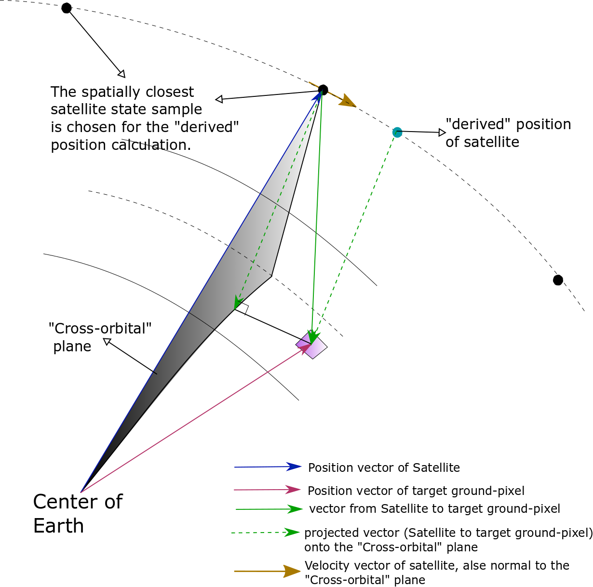

Appendix
*********

.. _satellite_to_target_viewing_geometry:

Satellite to Target viewing geometry
=============================================

.. figure:: space_viewing_geometry_SandiaReport.png

*   :math:`\mathbf{R = T - S}`
*   :math:`\gamma = \cos^{-1}(\mathbf{\dfrac{R}{|R|}} \cdot \mathbf{\dfrac{-S}{|S|}})`
*   :math:`\theta_i = \sin^{-1}(\sin\gamma  \hspace{1mm}  \dfrac{R_E + h}{R_E})`

    .. note:: This formula assumes spherical Earth of radius :math:`R_E`

where,

* :math:`\mathbf{S}`: Position vector of the satellite in the Earth-Centered-Inertial frame (equatorial-plane)
* :math:`\mathbf{T}`: Position vector of the target ground-point in the Earth-Centered-Inertial frame (equatorial-plane)
* :math:`\mathbf{R}`: Range vector from satellite to target ground point
* :math:`\gamma`:  Look-angle to target ground point from satellite
* :math:`\theta_i`: Incidence angle at the target ground point
* :math:`R_E`: Nominal equatorial radius of Earth
* :math:`h`: altitude of satellite

.. todo: Add Solar elevation illustration

.. _derived_satellite_coords:

Calculation of the "derived" Satellite position and time 
=========================================================

Definition of the "derived" position, time of satellite: The position of satellite at which the line from 
the ground-pixel to the satellite is perpendicular to the satellite velocity.

The data of the satellite cartesian states supplied by the user, may not have the data-point corresponding to the time at which
the satellite is the state as dictated by the above constraint. So we estimate the satellite cartesian position and time
corresponding to the relative geometry with the target ground-pixel as defined by the constraint.

.. note:: This approximate calculation of "derived" position, time of satellite works well because of large curvature of Earth (compared to the
          altitude of satellite), and short time intervals of calculation (selected sample point from which the "derived" position, time is calculated
          is chosen to be closest (typically few seconds away) to the middle of access interval).

:math:`{\bf n_{crOrbPl} = v_{sc}}`

:math:`{\bf r^{proj}_{CrOrbPl} = \bf R - (R \cdot n_{crOrbPl}) n_{crOrbPl}}`

:math:`{\bf R^{drv} =  r^{proj}_{CrOrbPl}}`

:math:`{\bf S^{drv} = T - R^{drv}}`

Calculate corresponding :math:`\theta_i^{drv}`, :math:`\gamma^{drv}` using framework in :ref:`satellite_to_target_viewing_geometry`.

:math:`T_{obs}^{drv} = T_{obs} + |{\bf S^{drv} - S}|/ v_{sc}`

where,

* :math:`\mathbf{S}`: Position vector of the satellite in the Earth-Centered-Inertial frame (equatorial-plane)
* :math:`\mathbf{T}`: Position vector of the target ground-point in the Earth-Centered-Inertial frame (equatorial-plane)
* :math:`\mathbf{R}`: Range vector from satellite to target ground point
* :math:`{\bf n_{crOrbPl}}`: "Cross-orbital-plane" normal vector
* :math:`{\bf v_{sc}}`: Velocity of satellite in Earth-Centered-Inertial frame (equatorial plane)
* :math:`{\bf r^{proj}_{CrOrbPl}}`: Projection of range-vector onto the cross-orbital-plane.
* :math:`{\bf R_{drv}}`: "derived" range-vector
* :math:`{\bf S_{drv}}`: "derived" satellite position
* :math:`\theta_i^{drv}`: Look-angle to target ground point from satellite "derived" position
* :math:`\gamma^{drv}`: Incidence angle at the target ground point from satellite "derived" position
* :math:`T_{obs}`: Observation time
* :math:`T_{obs}^{drv}`: "derived" observation time

.. _orientation_json_string:

:code:`orientation` JSON string format
========================================
The instrument orientation is specified with respect to the Nadir-frame, where the definition of Nadir-frame is as follows:

*Nadir-frame*

* :math:`\bf X_{nadir}` axis: :math:`-({\bf Z_{nadir}} \times {\bf V})`, where :math:`\bf V` is the Velocity vector of satellite in Earth-Fixed frame) => aligned to orbit plane normal
* :math:`\bf Y_{nadir}` axis: :math:`({\bf Z_{nadir}} \times {\bf X_{nadir}})` => aligned to Velocity vector of Satellite for circular orbits
* :math:`\bf Z_{nadir}` axis: Aligned to Nadir vector (vector from Satellite to center of Earth in Earth-Fixed frame)

The first subfield of the :code:`orientation` JSON string is the :code:`convention` subfield.

.. csv-table:: Input parameter description 
   :header: Parameter, Type,Description
   :widths: 10,10,40

   convention, string, Accepted numbers are "SIDE_LOOK" and "XYZ".

According to the specified :code:`convention`, other subfields materialize as follows:

1. :code:`"convention": "SIDE_LOOK"`

If the orientation is to be specified via a side-look-angle, the following subfields apply:

.. csv-table:: Input parameter description 
   :header: Parameter, Type,Description
   :widths: 10,10,40

   sideLookAngle, number, Also commonly called as Nadir angle in degrees. 

.. note:: A positive SIDE_LOOK corresponds to anti-clockwise rotation applied around the to the Satellite velocity vector.

Example:

.. code-block:: python

               "orientation": {
                                "convention": "SIDE_LOOK",
                                "sideLookAngle":10
                              }

 
2. :code:`"convention": "XYZ"`

Here the orientation is to be specified via set of three rotation angles about the instrument primary axis. 
The order of (intrinsic) rotations is: (1) rotation about instrument X-axis, (2) rotation about instrument Y-axis and last 
(3) rotation about instrument Z-axis.

.. csv-table:: Input parameter description 
   :header: Parameter, Type,Description
   :widths: 10,10,40

   xRotation, number, rotation about instrument X-axis in degrees
   yRotation, number, rotation about instrument Y-axis is degrees
   zRotation, number, rotation about instrument Z-axis in degrees

Example:

.. code-block:: python

               "orientation": {
                                "convention": "XYZ",
                                "xRotation":10,
                                "yRotation":20,
                                "zRotation":0
                              }

.. _fieldOfView_json_string:

:code:`fieldOfView` JSON string format
========================================
The :code:`fieldOfView` can be specified in three ways, according to the parameter :code:`sensorGeometry` definition.

1. :code:`"sensorGeometry": "CONICAL"`

    .. csv-table:: Input parameter description 
        :header: Parameter, Type,Description
        :widths: 10,10,40

        fullConeAngle, number, Full cone angle in degrees. 

    Example:

    .. code-block:: python

                "fieldOfView": {
                                    "sensorGeometry": "CONICAL",
                                    "fullConeAngle":10
                                }

2. :code:`"sensorGeometry": "RECTANGULAR"`

    .. csv-table:: Input parameter description 
        :header: Parameter, Type,Description
        :widths: 10,10,40

        alongTrackFieldOfView, number, (full) along-track fov in degrees. 
        crossTrackFieldOfView, number, (full) cross-track fov in degrees.

    .. note:: Specified along-track fov **must** be less than cross-track fov.

    Example:

    .. code-block:: python

                "fieldOfView": {
                                    "sensorGeometry": "RECTANGULAR",
                                    "alongTrackFieldOfView":10,
                                    "crossTrackFieldOfView":30
                                }

    .. warning:: The along-track FOV and cross-track FOV specs are assigned assuming the instrument is in nominal orientation, i.e. the instrument is aligned to nadir-frame.
                 If the instrument is rotated about the satellite body frame (by specifying non-zero orientation angles in the instrument json specs file), the actual along-track
                 and cross-track fovs simulated maybe different.

3. :code:`"sensorGeometry": "CUSTOM"`

    In this case the field-of-view is specified in terms of clock ,cone angles. The definition of the clock, cone angles is the 
    same as used in Orbit and Coverage module, i.e.

    Cone angles are angles measured from +Z sensor axis. If (:math:`xP`, :math:`yP`, :math:`zP`) is a unit vector describing a FOV point, then the 
    cone angle for the point is :math:`\pi/2 - \sin^{-1} zP`

    Clock angles are angles (right ascensions) measured anti-clockwise from the + X-axis (of instrument).  If :math:`xP`, :math:`yP`, :math:`zP` is a unit vector describing a FOV point, then the 
    cone angle for the point is :math:`atan2(y,x)`

    .. csv-table:: Input parameter description 
        :header: Parameter, Type, Description
        :widths: 10,10,40

        customConeAnglesVector, string, array of cone angle (angle from Nadir vector) values separated by commas
        customClockAnglesVector, string, array of clock values separated by commas

    .. note:: The number of values in :code:`customConeAnglesVector` and :code:`customClockAnglesVector` should be the same (or) the number of 
              values in :code:`customConeAnglesVector` should be just one and no values in :code:`customClockAnglesVector`.

Example:

.. code-block:: python

               "fieldOfView": {
                                "sensorGeometry": "CUSTOM",
                                "customConeAnglesVector": [10,10,10,10],
                                "customClockAnglesVector": [30, 120, 180, 280]
                              }

   
Glossary of terms used in the package
======================================

Pixels vs Detectors

Pixels: Refer to ground pixels imaged. Dimensions vary according to imaging geometry.

Detectors: Refer to physical detector elements on the imaging aperture.

Access vs Coverage

satellite, spacecraft

target

observation incidence angle for the case of non-radars

Coding Conventions
===================

* variables denoting physical quantities, unless otherwise indicated are always in S.I. units.

