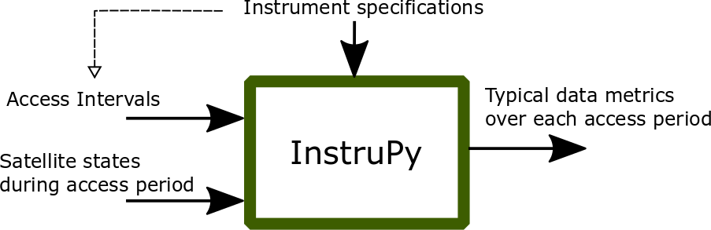

.. instrupy documentation master file, created by
   sphinx-quickstart on Sat Jan  5 10:39:21 2019.
   You can adapt this file completely to your liking, but it should at least
   contain the root `toctree` directive.

Welcome to InstruPy's documentation!
************************************

    The high-level function of the InstruPy package is shown in the figure. The package ingests 
    access interval information and satellite states (time, position, velocity) information, and instrument
    specifications (for which the access data is generated), and outputs typical data metrics of observations
    made during the access interval.

.. note:: For each access interval, it is assumed one observation image is built over the entire interval. Thus we get one set of 
          observation metrics corresponding to the observation data taken over the entire interval.

For a more detailed conceptual overview refer: S. Nag, V. Ravindra, J.J. LeMoigne *"Instrument Modeling Concepts for Tradespace Analysis of Satellite Constellations",* IEEE Sensors Conference, Delhi, India, October 2018.

.. toctree::
   :maxdepth: 3
   :caption: Contents:

   instruments_description
   input_satellite_states_access_desc
   outputs_description
   api_reference
   appendix

.. note:: Auxillary script :mod:`check_code_style` is included to help developers make code adhering
          to the default standards of :mod:`pycodestyle`.

Indices and tables
==================

* :ref:`genindex`
* :ref:`modindex`
* :ref:`search`

Questions?
==========
Please contact Vinay (vinay.ravindra@nasa.gov)

