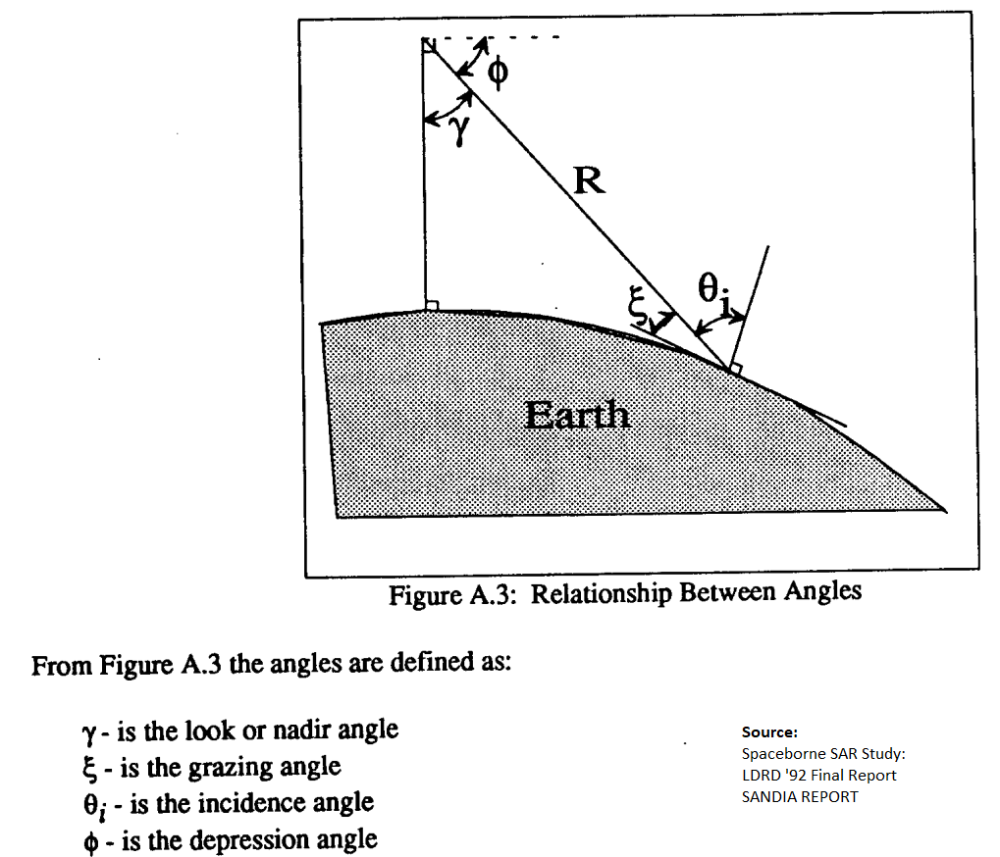
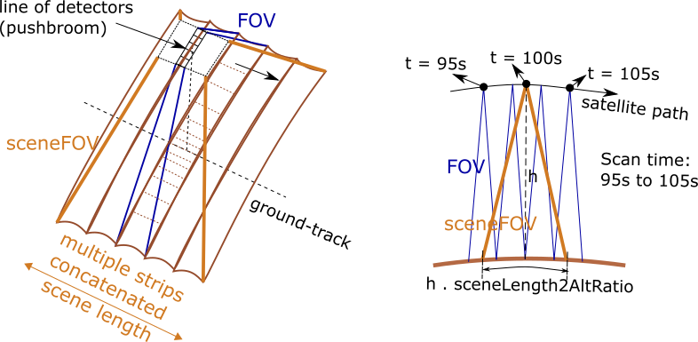
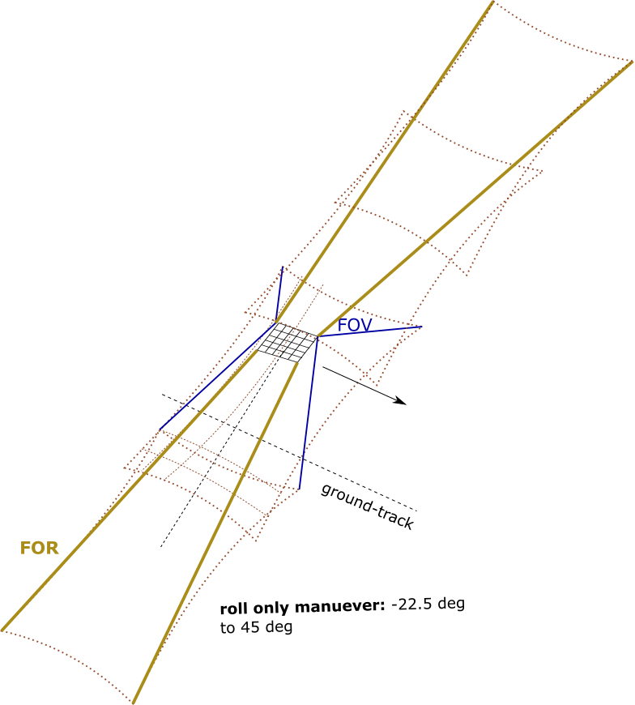
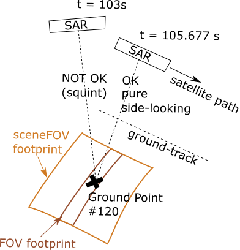

Miscellaneous
*************

.. _satellite_to_target_viewing_geometry:

Satellite to Target viewing geometry
=============================================

*   :math:`\mathbf{R = T - S}`
*   :math:`\gamma = \cos^{-1}(\mathbf{\dfrac{R}{|R|}} \cdot \mathbf{\dfrac{-S}{|S|}})`
*   :math:`\theta_i = \sin^{-1}(\sin\gamma  \hspace{1mm}  \dfrac{R_E + h}{R_E})`

Assuming spherical Earth of radius :math:`R_E`

where,

* :math:`\mathbf{S}`: Position vector of the satellite in the Earth-Centered-Inertial frame (equatorial-plane)
* :math:`\mathbf{T}`: Position vector of the target ground-point in the Earth-Centered-Inertial frame (equatorial-plane)
* :math:`\mathbf{R}`: Range vector from satellite to target ground point
* :math:`\gamma`:  Look-angle to target ground point from satellite
* :math:`\theta_i`: Incidence angle at the target ground point
* :math:`R_E`: Nominal equatorial radius of Earth
* :math:`h`: altitude of satellite

.. _ifov_fov_scenefov_for_desc:

IFOV, FOV, Scene-FOV, FOR description
=============================================

* **IFOV:** The so called "Instantaneous" Field Of View, corresponding to the Field Of View (FOV) 
  of a single detector on a focal plane array of optical instruments. Note that this concept would not apply
  to a SAR.

* **FOV:** Field Of View of the instrument corresponding to the solid angle subtended by the sensor at any instant of time.

* **SceneFOV:** Instruments with narrow along-track FOV such as in the case of pushbroom scanners and SARs, build an observation 
  "scene" by scanning narrow strips along the direction of movement of the spacecraft. Hence a scene is built from multiple 
  concatenated strips. By defining a parameter called as the :code:`sceneLen2AltRatio` we can approximate the FOV of such instruments
  to be rectangular such that the along-track FOV = atan(:code:`sceneLen2AltRatio`). The cross-track FOV is the same as the original
  instrument cross-track FOV. By defining the parameter :code:`sceneLen2AltRatio`, the along-track FOV is made independent of the 
  altitude at which the spacecraft is flown, but the length of the scene shall vary according to the altitude. A key fallout of 
  defining the SceneFOV is that, the SceneFOV corresponds to a finite length of time (scanning time). 
  
  Eg: Landsat TIRS (pushbroom) has along-track FOV of 141 urad. Swath width (corresponding to cross-track FOV = 15 deg) is 185 km.

  1.  Specifying (h . sceneLength2AltRatio = 100km) gives the along-track sceneFOV = 8.1689 deg.
      (Hence 185km x 100km scene size). Scan time is 14s.
  
  2.  Specifying (h . sceneLength2AltRatio = 10km) gives the along-track sceneFOV = 0.8185 deg.
      185km x 10km scene size.  Scan time is 1.4s. 

.. note:: Even though the original FOV of the instrument maybe rectangular, the resulting SceneFOV is only approximately rectangular
          due to the rotation of the Earth. The approximation is good for small scan times.

* **FOR:** The Field Of Regard is the total angular region which *can be* (not *will be* as in case of FOV) covered by 
  the instrument at any instant of time. This applies for the case of manueverable payloads where the instrument orientation 
  can be changed.

  .. warning:: After computing the access over grid-points using the FOR, just because a grid point is accessed (at some time), it 
               does not imply that the sensor can be pointed to that grid-point. The grid-point can occur outside the maneuver zone and 
               within the FOR perimeter.

Illustrations
^^^^^^^^^^^^^^^

.. figure:: ifov_vs_fov.png
    :scale: 75 %
    :align: center

    IFOV vs FOV illustration for the case of a Matrix imager

    FOV vs SceneFOV illustration for the case of a pushbroom scanner

    FOV/SceneFOV vs FOR illustration for the case of a possible -22.5 deg to 45 deg roll of satellite.

Access calculations when SceneFOV concept is applied
^^^^^^^^^^^^^^^^^^^^^^^^^^^^^^^^^^^^^^^^^^^^^^^^^^^^^

Access calculations for the instruments characterized by the SceneFOV shall result in longer access intervals. The access results need 
to be *corrected*. For example, consider a SAR instrument pointing sideways as shown in the figure below. The along-track FOV is narrow
corresponding to narrow strips, and a scene is built from concatenated strips. A SceneFOV is associated with the SAR and is used for access 
calculation over the grid point shown in the figure. Say the propagation time-step is 1s as shown in the figure. An acccess interval between
t=100s to t=105s is registered. However as shown the actual access takes place over a small interval of time at t=103.177s. 

An approximation can be applied (i.e. correction is made) that the observaton time of the ground point is at the middle of the access
interval rounded of to the nearest propgation time as calculated using the SceneFOV, i.e. :math:`t=((105-100)/2) % 1 = 103s`. The state 
of the spacecraft at :math:`t=103s` is utilized for the data-metrics calculation.

.. figure:: scenefov_access.png
    :scale: 75 %
    :align: center

    Need for *correction* for access calculations done using sceneFOV 

.. _purely_side_looking:

Purely Side Looking Instruments
=================================

Some instruments such as Synthetic Aperture Radars operating under Stripmap mode are constrained to point sideways with 
a fixed squint angle (usually 0 squint). The SAR model in the :code:`instrupy` package assumes Stripmap operating mode 
with zero-squint angle and hence falls under the category of purely side-looking instruments. Further, since the imaging
takes place by imaging of consequetive strips and building a scene, a *SceneFOV* may be associated with the instrument. 

    SAR pure side looking geometry illustration.

.. _manuv_desc:

Manuverability and corresponging FOR calculations
===================================================

There are four types of maneuver which can be specified by the user. Depending on the geometry of the underlying FOV/ SceneFOV, 
a FOR is calculated as described below. 

1. :code:`"@type":"Fixed"`

   This is equivalent to specifying a no-manuever. The resulting FOR is equal to the instrument FOV/ SceneFOV.

2. :code:`"@type":"Yaw180"`

    This manuver option indicates that the pointing axis can be manuevered to an orientation at 180 deg about the 
    satellite yaw axis (nadir vector).  

3. :code:`"@type":"Cone"`

    This manuver option indicates that the pointing axis can be manuevered within a conical region (within a user-defined
    conical angle). The rotation about the pointing axis is unrestricted. The resulting FOR per sensor FOV is as follows:

        * Conical FOV sensor: FOR is conical with cone angle = manuver cone angle + sensor cone angle

        * Retangular FOV sensor: FOR is conical with cone angle = manuver cone angle + half diagonal angle of the rectangular FOV

        where half diagonal angle of the rectangular FOV = acos( cos(along-track FOV/2) . cos(cross-track FOV/2) )

4. :code:`"@type":"RollOnly"`

    This manuver option indicates that the pointing axis can be manuevered along the roll axis (satellite velocity vector)
    over a range indicated by :code:`rollMin` and :code:`rollMax`. The resulting FOR per sensor FOV is as follows:
       
        * Conical FOV sensor: FOR is rectangular with:
            
            cross track = (rollMax - rollMin) + sensor full cone angle

            along-track = sensor along track

        * Retangular FOV sensor: FOR is rectangular with:
            
            cross-track = (rollMax - rollMin) + sensor cross track 

            along-track = sensor along track

5. :code:`"@type":"Yaw180Roll"`

    This manuver option indicates combines the :code:`"@type":"Yaw180"` and :code:`"@type":"RollOnly"` options.

.. figure:: cone_yaw180_maneuver.png
    :scale: 75 %
    :align: center

    Illustration of Cone maneuver and Yaw180 maneuver for rectangular FOV instruments

.. figure:: rollonly_maneuver.png
    :scale: 75 %
    :align: center

    Illustration of RollOnly maneuver for conical and rectangular FOV instruments
  
Glossary of terms used in the package
======================================

Pixels vs Detectorsx

Pixels: Refer to ground pixels imaged. Dimensions vary according to imaging geometry.

Detectors: Refer to physical detector elements on the imaging aperture.

Access vs Coverage

satellite, spacecraft

target

observation incidence angle for the case of non-radars

Coding Conventions
===================

* variables denoting physical quantities, unless otherwise indicated are always in S.I. units.

